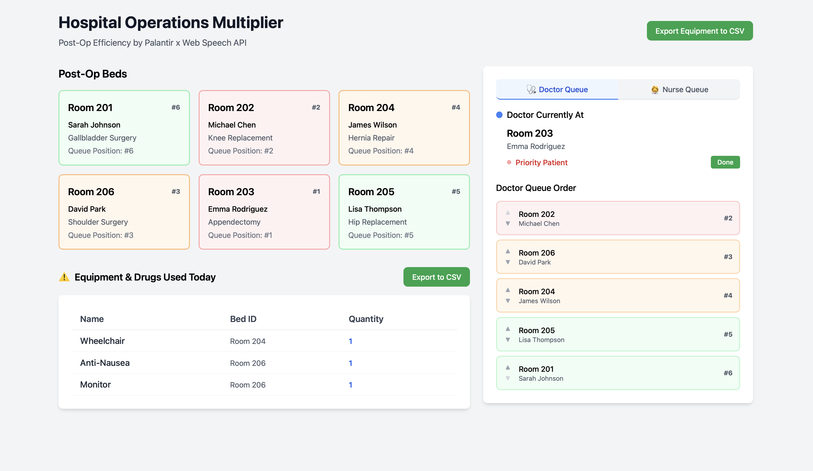
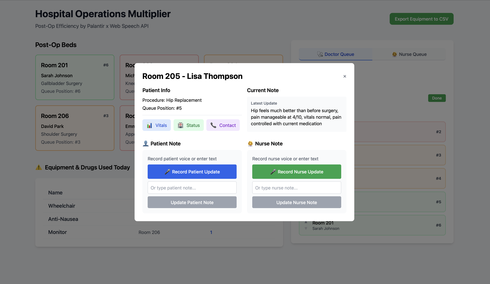

# Hospital Post-Op Coordination Dashboard

An intelligent real-time hospital dashboard system that optimizes post-operative patient care through AI-driven queue prioritization, automated equipment tracking, and seamless nurse-doctor coordination. Built with Palantir Foundry ontology integration and OpenAI-powered smart workflows.

## Screenshots


*Main dashboard showing patient queue with AI-prioritized visit order based on medical urgency*


*Patient bed details with equipment tracking, voice-to-text notes, and real-time updates*

## Features

- **🧠 AI-Powered Queue Prioritization**: OpenAI-driven patient visit ordering based on pain levels, medical urgency, and time factors
- **🎤 Voice-to-Text Integration**: Web Speech API with manual start/stop controls for hands-free note taking
- **📋 Intelligent Note Merging**: AI-powered note updates that preserve medical history and context
- **🔧 Automated Equipment Tracking**: Real-time extraction and monitoring of medical equipment from patient notes
- **⚡ Real-Time Updates**: Live dashboard updates with automatic queue recalculation after every note change
- **🏥 Palantir Foundry Integration**: Enterprise-grade ontology-based data persistence and management

## Tech Stack

- **Backend**: Python Flask with Palantir Foundry SDK
- **Frontend**: React with Tailwind CSS  
- **Data**: Palantir Foundry Ontology
- **AI**: OpenAI GPT-4 + Palantir AIP smart priority queue function
- **Voice**: Web Speech API for voice-to-text transcription

## Setup

### Backend
```bash
pip install -r requirements.txt
export FOUNDRY_TOKEN="your_token_here"
python app.py
```

### Frontend
```bash
cd hospital-dashboard
npm install
npm start
```

## Usage

1. Access the dashboard at http://localhost:3000
2. View post-op beds with queue positions determined by AIP
3. Click beds to add patient/nurse updates
4. Priority patient queue updates automatically
5. Equipment needs are extracted and tracked

## Architecture

The system uses Palantir Foundry ontology objects for all data operations:
- `BedData` objects store patient information
- `smart_priority_queue` AIP function determines visit order
- Real-time updates through ontology actions 
